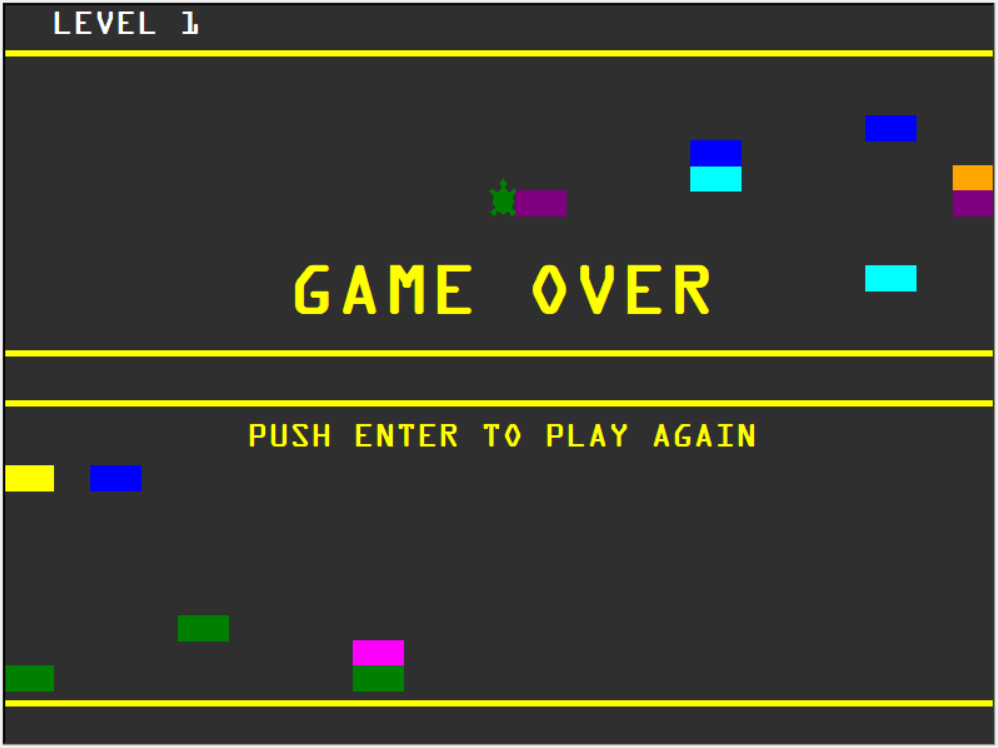
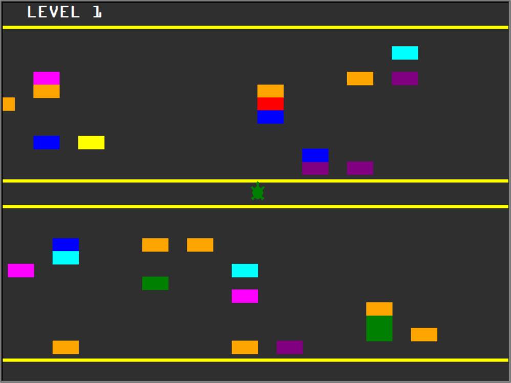

# Crossy Turtle Python Game

## Description

This is a spin off the Crossy Road games, except its in 2D and here the turtle has to cross the road without being hit by traffic.

Once you reach the top of the screen the speed of the cars increases and you start at the bottom again.

I don't think anyone will make it past level 10 with current settings as is.

Challenge accepted - This was so much fun to try and figure out all the different things and to get it working.

## How to Use/Run

This was writen in Python 3.10 so should run fine on your system if you have python 3.10 installed

Simply run main.py

Basic Controls

- Up to move the player(Turtle) up
- Return/Enter to Restart the game

### Additional modules needed

- None - No addition libraries required

### Screenshots

### Game Features

- Fun Crossy Road style game in 2D
- increasing difficulty level (speed)
- 2 Way moving traffic in more difficult levels
- Level up
- Restart the game by hitting enter or Return

### Files Included

> car.py
>
> - Implements the Car class that move accross the screen

> main.py
>
> - Implements the main game loop and functionality

> player.py
>
> - Implements the Player class (Turtle that has to cross the road)

> score.py
>
> - Implements the Score ClassKeeps track of the level you are on

> road.py
>
> - Implements the Road class and basically draws the roads on the screen

---

  

  
